# College Feedback System

A web application that enables students to submit anonymous feedback on courses and instructors. Admin users can view and analyze feedback to improve teaching quality. Built with **Java Spring Boot** backend, **MongoDB** for storage, and a responsive UI. Secure login and role-based access control are supported.

---

## 🛠️ Technologies Used

- Java Spring Boot
- MongoDB
- Vaadin (UI Framework)
- REST APIs
- Lombok, Spring Security
- Git & GitHub

---

## 🗃️ Database Structure (MongoDB)

Here’s the basic structure of the main MongoDB collections:

### 🔹 `users` collection
```json
{
  "_id": {
    "$oid": "688e3505492c11bcd72aa6f6"
  },
  "fullName": "Amna Alshawa",
  "email": "student@learning.com",
  "password": "1234567",
  "role": "student"
}
```
### 🔹 `students` collection
```json
{
  "_id": {
    "$oid": "688e2d7c492c11bcd72aa6cf"
  },
  "fullName": "Amna Alshawa",
  "email": "student@learning.com"
}
```
### 🔹 `instructors` collection
```json
{
  "_id": {
    "$oid": "688e2de7492c11bcd72aa6d5"
  },
  "fullName": "Anaz Najaa",
  "department": "Computer Engineer"
}
```
### 🔹 `feedbacks` collection
```json
{
  "_id": {
    "$oid": "688e3c02d349b9decfe46177"
  },
  "studentId": "688e2d7c492c11bcd72aa6cf",
  "courseId": "688e2e2d492c11bcd72aa6d8",
  "courseName": "Introduction to Network",
  "rating": 3.5,
  "comment": "Not bad but can be improved by adding some interactions",
  "createdAt": {
    "$date": "2025-08-02T16:25:38.579Z"
  },
  "_class": "com.example.feedback.model.Feedback",
  "instructorId": "688e2de7492c11bcd72aa6d5",
  "instructorName": "Anaz Najaa"
}
```
### 🔹 `enrollments` collection
```json
{
  "_id": {
    "$oid": "688e2ebc492c11bcd72aa6e0"
  },
  "studentId": "688e2d7c492c11bcd72aa6cf",
  "courseId": "688e2e2d492c11bcd72aa6d8"
}
```
### 🔹 `courses` collection
```json
{
  "_id": {
    "$oid": "688e2e2d492c11bcd72aa6d8"
  },
  "name": "Introduction to Network",
  "instructorId": "688e2de7492c11bcd72aa6d5"
}
```
---
## 👩‍💼 Admin Use Cases
1) Login by admin user
2) View courses & instrutors rating with filteration
3) Export feefback sheet

### screenshots
Login by admin user
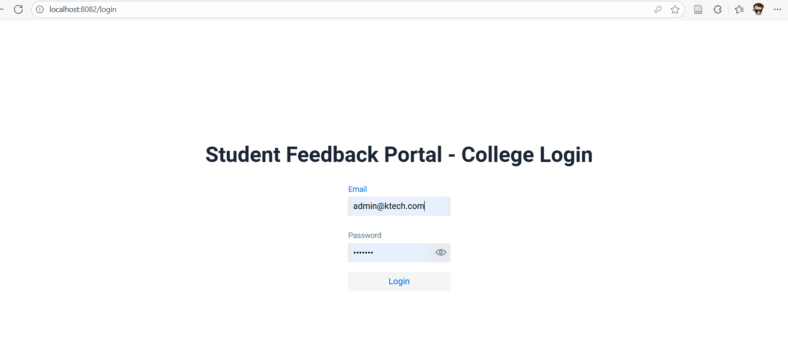

View courses & instrutors rating with filteration
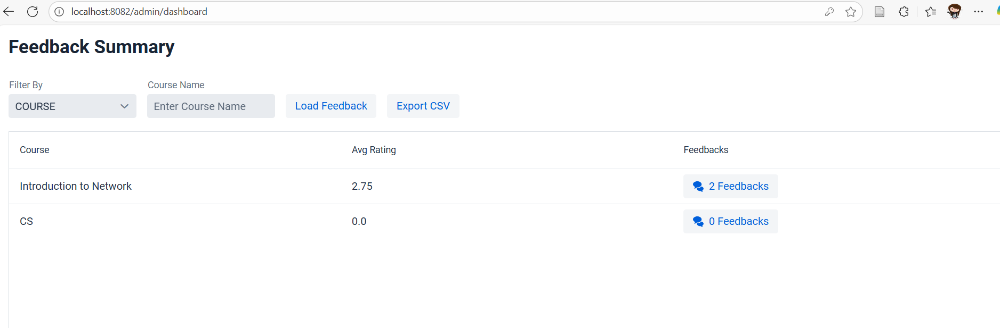
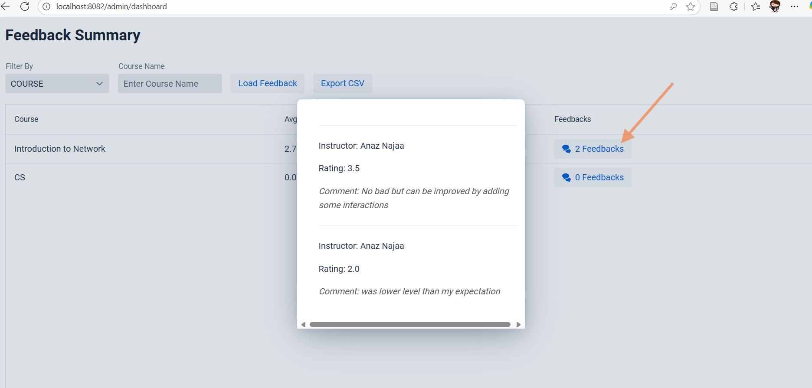
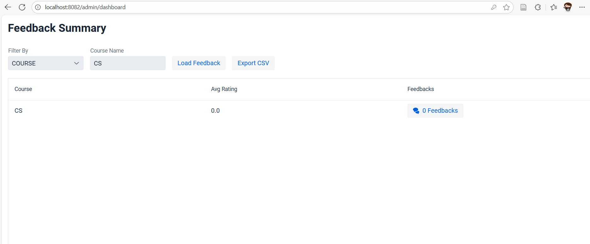
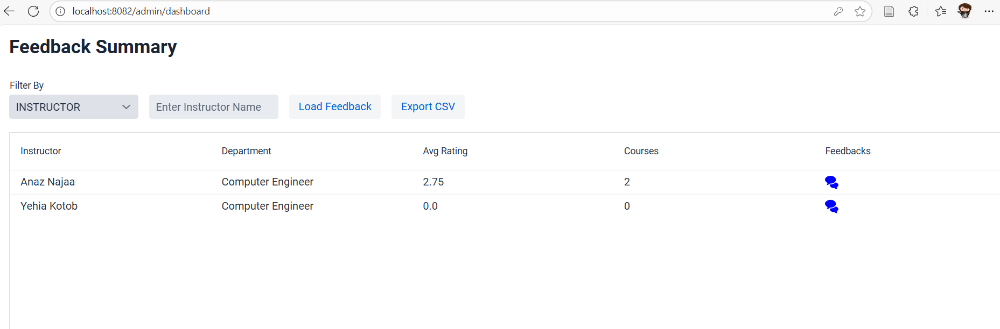
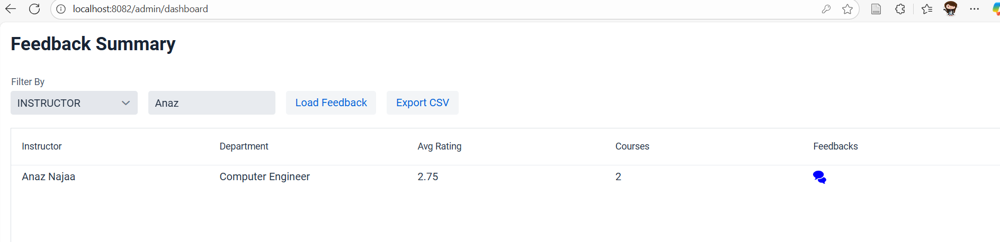

Export feefback sheet
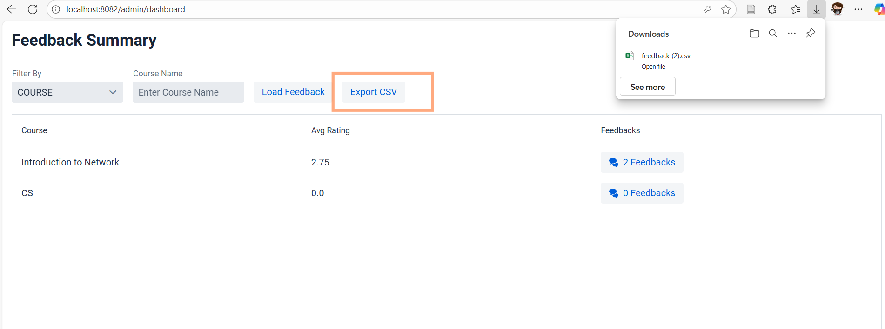
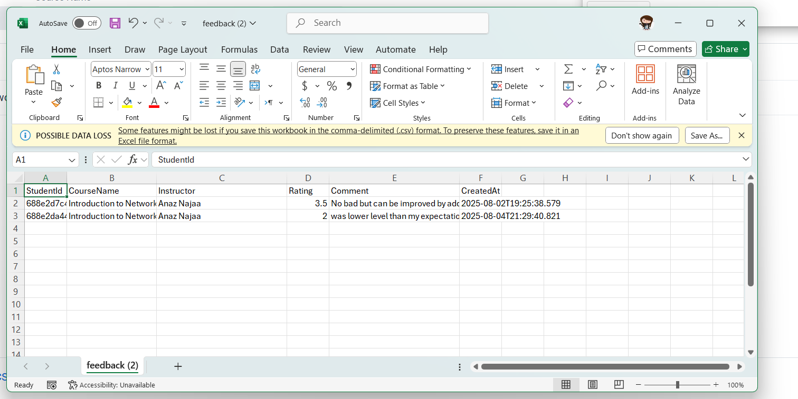


---
## 🎓 Student Use Cases
1) Login by student user
2) View enrolled courses
3) Submit course feedback if not already exists
4) View course feedback

### screenshots
Login by student user
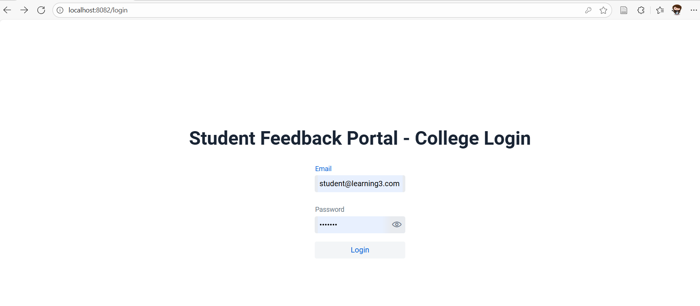


View enrolled courses
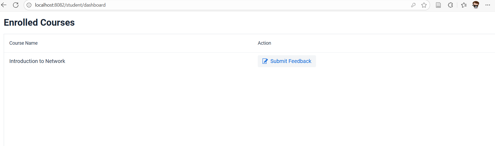

Submit course feedback if not already exists
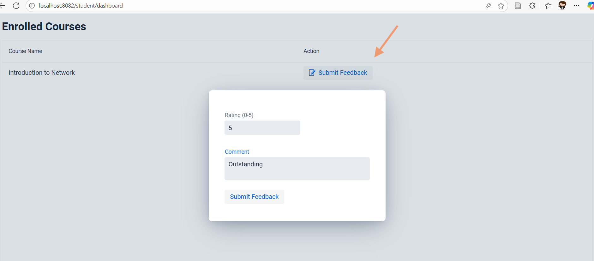

View course feedback
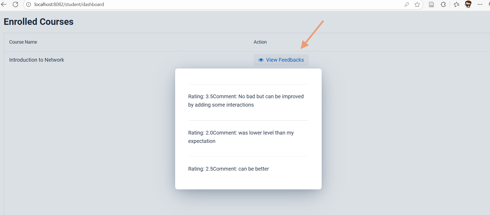


---
## 📬 API Collection (Postman)

You can explore all API endpoints using the following Postman collection:

👉 [View Postman Collection](https://lively-robot-360523.postman.co/workspace/Boutiqaat-Projects~8d121a4c-0db5-4b27-851d-016ed235cb1b/collection/19515366-5261409f-9fb1-446d-8af7-bfa4aa37dce1?action=share&creator=19515366)


